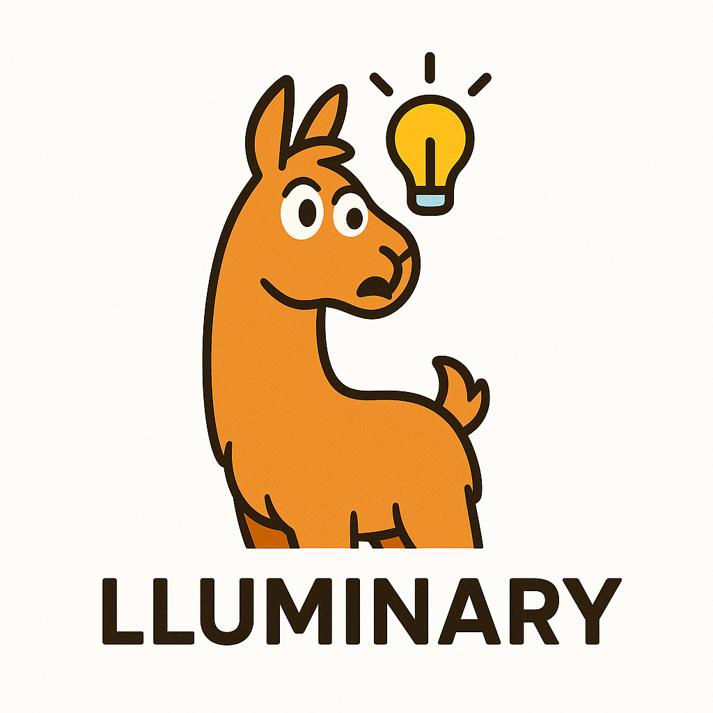

# Lluminary



A Ruby library for building LLM-powered applications with structured outputs.

## Features

- Task-based architecture for LLM interactions
- Automatic JSON response formatting based on output schemas
- Input and output schema validation
- Provider abstraction for different LLM services
- Built-in support for OpenAI and AWS Bedrock
- Easy to extend with custom providers
- Field descriptions for better LLM understanding
- Rich result objects with access to prompts and responses
- Global and task-specific provider configuration

## Lluminary Schemas

Lluminary Schemas allow you to define the structure and constraints for both the inputs and outputs of your application or LLM interactions. The schema provides:

- A set of typed fields that indicate what form the data should take
- A mechanism for validating and ensuring the data conforms to these expected types
- A description of how an LLM should format its response (in the case of output schemas)

### Input Types

Lluminary supports these field types:

1. **String**  
   Usage example:  
   ```ruby
   class UserTask < Lluminary::Task
     input_schema do
       string :name, description: "The user's name"
     end
   end
   ```
   Allows any string value (including empty), or nil if specified.

2. **Integer**  
   Usage example:  
   ```ruby
   class UserTask < Lluminary::Task
     input_schema do
       integer :age, description: "The user's age"
     end
   end
   ```
   Validates that the value is an integer or nil.

3. **Boolean**  
   Usage example:  
   ```ruby
   class UserTask < Lluminary::Task
     input_schema do
       boolean :active, description: "Indicates if the user is active"
     end
   end
   ```
   Validates that the value is either true, false, or nil.

4. **Float**  
   Usage example:  
   ```ruby
   class ProductTask < Lluminary::Task
     input_schema do
       float :price, description: "The price of an item"
     end
   end
   ```
   Validates that the value is a float or nil.

5. **DateTime**  
   Usage example:  
   ```ruby
   class EventTask < Lluminary::Task
     input_schema do
       datetime :start_time, description: "When the event starts"
     end
   end
   ```
   Validates that the value is a Ruby DateTime object. When used in output schemas, the LLM will be instructed to return dates in ISO8601 format (e.g., "2024-01-01T12:00:00+00:00"). The library handles the conversion between DateTime objects and ISO8601 strings and back again automatically.

6. **Array**  
   Arrays can be defined with or without a specific element type. When typed, arrays can contain elements of any of the supported types (string, integer, boolean, float, datetime, etc). The element type is specified in a block.
   
   Usage example with strings:  
   ```ruby
   class MealSuggester < Lluminary::Task
     input_schema do
       array :ingredients do
         string
       end
       validates :ingredients, presence: true, length: { minimum: 1 }
     end
   end
   ```

   Usage example with integers:
   ```ruby
   class NumberProcessor < Lluminary::Task
     output_schema do
       array :counts, description: "List of counts" do
         integer
       end
     end
   end
   ```

   You can also define untyped arrays by omitting the block:
   ```ruby
   class GenericTask < Lluminary::Task
     output_schema do
       array :items, description: "List of items"
     end
   end
   ```

   Arrays can also contain hashes (objects), allowing for lists of structured data:
   ```ruby
   class ProductListTask < Lluminary::Task
     output_schema do
       array :products, description: "List of products" do
         hash do
           string :name, description: "Product name"
           float :price, description: "Product price"
           integer :stock, description: "Units in stock"
         end
       end
     end
   end
   ```

   When used in output schemas, the LLM will be instructed to return arrays in the appropriate format based on the element type.

7. **Hash** (Object)  
   Hashes allow you to define nested structured data with their own sets of fields. You can nest hashes within each other to create complex data structures.
   
   Usage example:  
   ```ruby
   class UserProfileTask < Lluminary::Task
     output_schema do
       hash :user, description: "User profile data" do
         string :name, description: "User's full name"
         integer :age
         hash :address do
           string :street, description: "Street address"
           string :city
           string :country
         end
       end
     end
   end
   ```

   Hash fields can contain any other field types, including nested hashes, arrays, and primitive types:
   ```ruby
   class UserDataTask < Lluminary::Task
     output_schema do
       hash :user_data, description: "Complete user information" do
         string :username
         # Nested hash
         hash :contact_info do
           string :email
           string :phone
         end
         # Array within a hash
         array :permissions do
           string
         end
         # Hash with datetime
         hash :account_info do
           datetime :created_at, description: "Account creation date"
           boolean :is_active
         end
       end
     end
   end
   ```

   When used in output schemas, the LLM will be instructed to return the hash with all its nested fields in the correct structure. All hash keys will be strings, not symbols, since Lluminary is creating hashes from deserialized JSON returned by the LLM.

All of these field definitions allow nil values by default, ensuring that optional data can be omitted.

### Validations

Lluminary's validation system is built on top of ActiveModel validations, which will feel familiar to Rails developers. When you run a task, two things happen:

1. First, Lluminary checks that all inputs match their defined types (string, integer, boolean, float)
2. Then, ActiveModel validations are run to enforce additional constraints

This means you can use most standard ActiveModel validations in your schemas. Here's an example:

```ruby
class UserTask < Lluminary::Task
  input_schema do
    string :name
    integer :age
    
    validates :name, presence: true
    validates :age, numericality: { greater_than: 0 }
  end
end
```

For a complete list of available validations, see the [ActiveModel Validations documentation](https://guides.rubyonrails.org/active_record_validations.html).

Note: While you can use all standard ActiveModel validations, custom validation methods and classes are not yet supported. This feature is planned for a future release.

### How Output Schemas Work

Output schemas in Lluminary serve two important purposes:

1. **LLM Instruction**: The schema is used to generate clear instructions for the LLM about:
   - What fields it should return
   - What type each field should be
   - What each field means (through descriptions)
   - Any validation rules that must be followed

   This means you don't need to manually describe the expected output format in your prompt - Lluminary automatically includes this information based on your schema definition.

2. **Response Validation**: After the LLM responds, the same schema is used to:
   - Validate that the response matches the expected structure
   - Ensure all fields are of the correct type
   - Apply any ActiveModel validations to the returned data

For example, when you define an output schema:
```ruby
class AnalysisTask < Lluminary::Task
  output_schema do
    string :title, description: "Suggested title"
    float :score, description: "Confidence score"
    
    validates :score, numericality: { greater_than: 0, less_than: 1 }
  end
end
```

Lluminary will:
1. Automatically include these field definitions and descriptions in the prompt to the LLM, eliminating the need for you to manually describe the expected output format
2. After receiving the response, validate that:
   - The `title` is a string
   - The `score` is a float between 0 and 1
   - All required fields are present

You can check the validation results and access the output values:
```ruby
result = AnalysisTask.call(input_params)
if result.output.valid?
  puts result.output.title  # => "Hello World"
  puts result.output.score  # => 0.98
else
  puts result.output.errors.full_messages
end
```

### Viewing Input/Output and Validations

When you create a task with schemas, Lluminary automatically handles validation and provides access to the results:

```ruby
class ProductTask < Lluminary::Task
  input_schema do
    integer :count
    float :price
  end
end

# Valid input example
result = ProductTask.call(count: 5, price: nil)
puts result.input.valid?  # => true
puts result.input.errors.full_messages  # => []

# Invalid input example
result = ProductTask.call(count: "five", price: "ten")
puts result.input.valid?  # => false
puts result.input.errors.full_messages  # => ["Count must be an Integer", "Price must be a float"]
```

## Installation

Add this line to your application's Gemfile:

```ruby
gem 'lluminary'
```

And then execute:

```bash
bundle install
```

## Configuration

Lluminary supports both global and task-specific provider configurations. Global configurations are set once and can be overridden per task.

### Global Configuration

Create a configuration file (e.g., `config/lluminary.rb`) in your application:

```ruby
require 'lluminary'

Lluminary.configure do |config|
  # OpenAI Configuration
  config.provider(:openai, 
    api_key: ENV['OPENAI_API_KEY'],
    model: Lluminary::Models::OpenAi::Gpt35Turbo  # Optional: specify which model to use
  )

  # AWS Bedrock Configuration
  config.provider(:bedrock,
    access_key_id: ENV['AWS_ACCESS_KEY_ID'],
    secret_access_key: ENV['AWS_SECRET_ACCESS_KEY'],
    region: ENV['AWS_REGION'],
    model: Lluminary::Models::Bedrock::MetaLlama38bInstructV10
  )
end
```

### Model Configuration

Each provider has a default model that will be used if none is specified: (At this point they were chosen arbitrarily.)

- OpenAI: `Lluminary::Models::OpenAi::Gpt35Turbo`
- AWS Bedrock: `Lluminary::Models::Bedrock::AnthropicClaudeInstantV1`

You can override the model at both the global configuration level and the task level:

```ruby
# Global configuration
Lluminary.configure do |config|
  config.provider(:openai, 
    api_key: ENV['OPENAI_API_KEY'],
    model: Lluminary::Models::OpenAi::Gpt35Turbo
  )
end

# Task-specific configuration
class HighQualityTask < Lluminary::Task
  # Override model for this specific task
  use_provider :openai, model: Lluminary::Models::OpenAi::Gpt4  
end
```

### Task-Specific Configuration

Tasks can use the global configuration or override it with their own settings:

```ruby
# Using global configuration
class DefaultConfigTask < Lluminary::Task
  use_provider :openai  # Uses the global OpenAI configuration
end

# Overriding global configuration
class CustomConfigTask < Lluminary::Task
  # Overrides both API key and model
  use_provider :openai, 
    api_key: 'custom-key', 
    model: Lluminary::Models::OpenAi::Gpt4 
end
```

## Usage

### Basic Task

Here's a complete example of a task that uses the global configuration:

```ruby
class SummarizeText < Lluminary::Task
  use_provider :openai  # Uses the global OpenAI configuration

  input_schema do
    string :text, description: "The text to be summarized"
  end

  output_schema do
    string :summary, description: "A concise one-sentence summary of the input text"
  end

  def task_prompt
    "Summarize the following text in one short sentence:\n\n#{text}"
  end
end

# Use the task
result = SummarizeText.call(text: "Your text here")
puts result.output.summary
```

### Schema Descriptions

The schema system supports optional descriptions for each field. These descriptions help the LLM understand exactly what each field should contain:

```ruby
class AnalyzeText < Lluminary::Task
  use_provider :openai  # Uses the global OpenAI configuration

  output_schema do
    string :sentiment, description: "The overall emotional tone (positive, negative, or neutral)"
    string :key_points, description: "The main ideas or arguments presented in the text"
    integer :word_count, description: "Total number of words in the text"
  end
end
```

These descriptions are automatically formatted and included in prompts to the LLM, helping it understand the expected structure and content of each field, including nested objects and arrays.

### Input and Output Validation

Tasks support validation through the schema system using ActiveModel validations. This means you have access to all standard ActiveModel validations for both input and output schemas.

#### Input Validation

```ruby
class WordCounter < Lluminary::Task
  use_provider :openai

  input_schema do
    string :text
    integer :min_length
    string :language, description: "The language of the text"

    # Standard validations
    validates :text, presence: true
    validates :min_length, presence: true, numericality: { greater_than: 0 }
    
    # Format validation
    validates :language, format: { with: /\A[a-z]{2}\z/, message: "must be a two-letter language code" }
  end
end
```

Common validations include:
- `presence`: Ensures a value is provided
- `numericality`: Validates numeric values
- `format`: Validates against a regular expression
- `inclusion`: Ensures a value is in a given set
- `length`: Validates string length
- `uniqueness`: Ensures a value is unique

For a complete list of validations, see the [ActiveModel Validations documentation](https://guides.rubyonrails.org/active_record_validations.html).

#### Output Validation

Output validation ensures that the LLM's response meets your requirements. The same validation rules available for input schemas can be used in output schemas:

```ruby
class AnalyzeText < Lluminary::Task
  use_provider :openai

  output_schema do
    string :sentiment, description: "The overall emotional tone"
    validates :sentiment, inclusion: { in: %w[positive negative neutral] }
    
    string :key_points, description: "The main ideas or arguments"
    validates :key_points, presence: true
    
    integer :word_count, description: "Total number of words"
    validates :word_count, numericality: { greater_than: 0 }
  end
end
```

Note: Custom validation methods and classes are not yet supported. This feature is planned for a future release. Additionally, future updates will include:
- Automatic validation rule sharing with the LLM to guide responses
- Retry mechanisms for failed output validation

#### Accessing Validation Results

You can check validation results and access input/output values through the result object:

```ruby
result = SomeTask.call(input_params)

# Check input validation
result.input.valid?  # => true/false
result.input.errors # => ActiveModel::Errors object

# Access input values defined in input_schema
result.input.text   # => "input text value"

# Check output validation
result.output.valid?  # => true/false
result.output.errors # => ActiveModel::Errors object

# Access output values defined in output_schema
result.output.summary # => "output summary value"

# Access raw LLM response (available even when validation fails)
result.raw_response # => Raw response from the LLM
```

## Running Examples

The examples in the `examples/` directory demonstrate various Lluminary features. To run them:

1. Create a `.env` file in the project root with the required environment variables:
   ```bash
   # OpenAI Configuration (required for OpenAI examples)
   OPENAI_API_KEY=your_openai_api_key

   # AWS Bedrock Configuration (required for Bedrock examples)
   AWS_ACCESS_KEY_ID=your_aws_access_key
   AWS_SECRET_ACCESS_KEY=your_aws_secret_key
   AWS_REGION=your_aws_region
   ```

2. Run an example:
   ```bash
   ruby examples/summarize_text.rb
   ```

Note: You only need to configure the providers you plan to use. For example, if you only want to run OpenAI examples, you only need to set the `OPENAI_API_KEY`.

## Provider Configuration Options

### OpenAI Provider

| Option | Required | Default | Description |
|--------|----------|---------|-------------|
| `api_key` | Yes | - | Your OpenAI API key |

### AWS Bedrock Provider

| Option | Required | Default | Description |
|--------|----------|---------|-------------|
| `access_key_id` | Yes | - | Your AWS access key ID |
| `secret_access_key` | Yes | - | Your AWS secret access key |
| `region` | Yes | - | The AWS region to use |

## Development

After checking out the repo, run `bin/setup` to install dependencies. Then, run `rake spec` to run the tests. You can also run `bin/console` for an interactive prompt that will allow you to experiment.

To install this gem onto your local machine, run `bundle exec rake install`. To release a new version, update the version number in `version.rb`, and then run `bundle exec rake release`, which will create a git tag for the version, push git commits and the created tag, and push the `.gem` file to [rubygems.org](https://rubygems.org).

## Contributing

Bug reports and pull requests are welcome on GitHub at https://github.com/yourusername/lluminary. This project is intended to be a safe, welcoming space for collaboration, and contributors are expected to adhere to the [code of conduct](https://github.com/yourusername/lluminary/blob/master/CODE_OF_CONDUCT.md).

## License

The gem is available as open source under the terms of the [MIT License](https://opensource.org/licenses/MIT).

## Code of Conduct

Everyone interacting in the Lluminary project's codebases, issue trackers, chat rooms and mailing lists is expected to follow the [code of conduct](https://github.com/yourusername/lluminary/blob/master/CODE_OF_CONDUCT.md).
